# splunk-group-workshop
## GitHub Pages
- https://bben6087.github.io/splunk-group-workshop/
##  The Team
|  |  | |  |
|------------------------------------------------------------------------------------------|-----------------------------------------------------------------------------------|-----------------------------------------------------------------------|---------------------------------------------------------------------|
| Blake Bennett | Seth Bennett | Logan Krohn | Zach Watson |

---

## Blake Bennett - Download, Install, Add Apps, and Monitoring Console
### How to Install
1. Head to https://www.splunk.com/ and click on the Free Splunk button in the top right hand corner  
2. Fill out information to create an account or login if you have a pre-existng account. Once logged in click the download for the application version of Splunk Enterprise.
3. Once it is downloaded run the installation file and run through the setup wizard. When it asks you to create an account remember your credentials for later. (Note: This step can take some time when installing)
4. It will lauch a server that your computer hosts and it will ask you to login using the credentials you created in the installation. 
5. Once logged in you will be directed to the homepage of the application and you have succesfully completed the installation of Splunk. 
### How to Add Apps to Splunk
1. Once at the main page click on "Find More Apps" in the side navigation bar and it will take you to a seperate page. This allows for the use of additional inside of Splunk making it a more versatile application which is neat!
2. Once there you can filter through different apps and find an app that will enhance your usage of splunk.
3. When you have found an app you want to install you simply click the green install button and it will prompt you to enter your credentials.
4. Once you have entered in your credentials successfully the app will be added to Splunk Enterprise. 
### Monitoring Console
1. From the Splunk Dashboard Overview go to settings and click on "Monitoring Console"
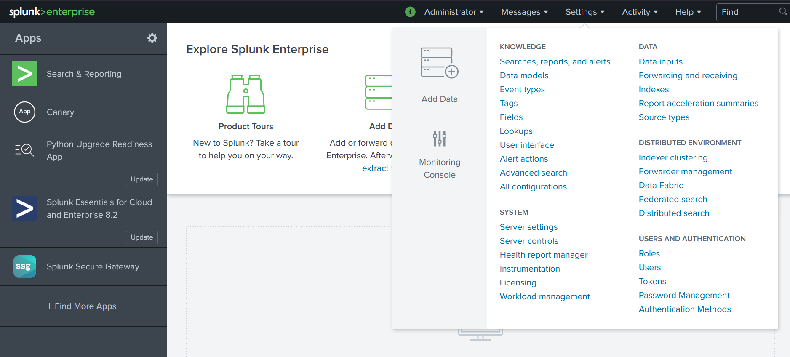
2. This monitoring lets you see when the PC was used at what time and what process are running
3. Click on the graphs or percentages for additional information regarding your machine and processes
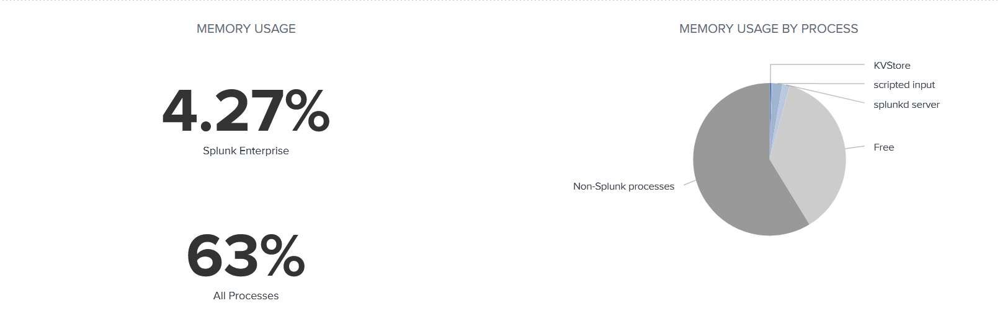
4. Here on this page you can dive into an even deeper look into what is running on your machine from RAM, to CPU, to even Input/Output processes which is cool.
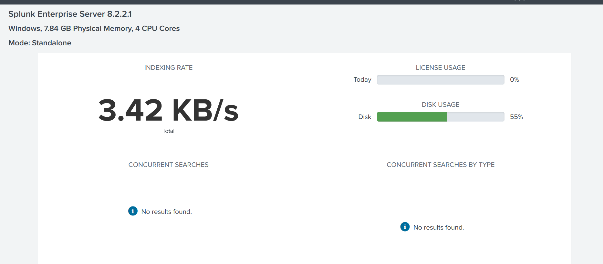
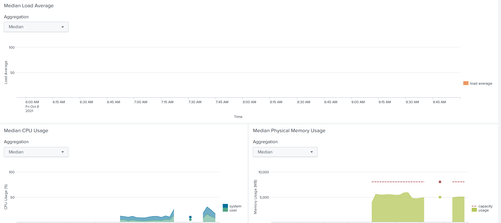
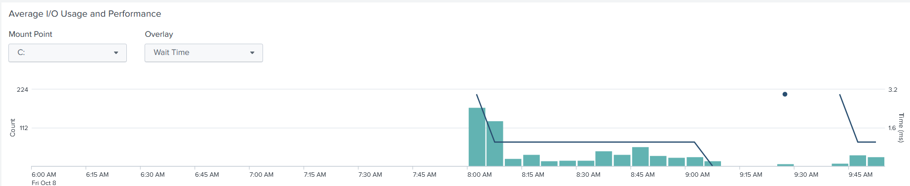
### What does installing additional apps and the monitoring console this have to do with Digital Forensics?
- Splunk is made for machine monitoring so you can monitor changes in your employees keystrokes, mouse usage, browsing, and file changes, etc. This allows companies to make sure employees are working or are not making malicous changes to company files without the comapny knowing. It tracks every change on the machine to every minute process. On top of that having a tool that allows the installation of additional apps that expand the capabilities of Splunk is a great feature. Which is what I covered. Having additional applications that expand Splunk allows for many configurations and versatility depending on your own personal or company needs. All in all the ability to add addtional apps for Digital Forensics and being able to monitor PC activity is a a great tool for Digital Investigators.
## Seth Bennett - Local System Monitoring
### Setting up File Directory Monitoring
1. Starting from the Splunk Dashboard First click "Settings" in the top right then click "Add Data"
    - 
2. From this point proceed to click the "Monitor" Button in the bottom section of the page
    - 
3. From this point you must select what source of data you would like to use I will will be using File & Directories in the example.
    - From Here Enter the exact File or Directory you would  like to monitor the files in and click next
    *I would recomend Being as specific as possible, the amount of information can be quite verbose*
    - 
4.  Next, you will be have several options, one of which is index, you may use one of the default indexes but I suggest Creating a new index for the specific job as seen in the pictures below and then click next
    - 
    - 
    - 
5. From here you should be met with this page confirming the information you have given and you may click submit
    - 
6. You have now successfully linked the monitor to your specified file or directory
### Searching your index
1. Starting from the Splunk Dashboard First click "Settings" in the top right then click "Monitor"
    - 
2. Once on the Monitor page click the "Run a Search" button in the top navbar
    - 
3. Now that you are ready to search your index, you may search by source, index, or both. Below are the syntaxs for the two options
    - source="YourFullDirectoryPath\\*"
    - index="YourIndexName"
    - 
---

## Logan Krohn - Plaso and Log2Timeline for Splunk
1. Go to https://plaso.readthedocs.io/en/latest/sources/user/Ubuntu-Packaged-Release.html and use the following commands in WSL to install the repository and Plaso for Ubuntu 20.04. 
2. Find a disk image you want to use and use the command 'log2timeline.py plaso.dump name-of-disk-image'. If asked to choose a partition, select the partition with the most content. If asked to select a VSS(volume shadow snapshot), select -all.
4. After completion use the command 'psort.py -o l2tcsv -w timeline.csv plaso.dump' to sort the content and write the database into a .csv file which we will use later.
5. In Splunk, go to settings and create a new index. Once done, go back to settings/Data Inputs/File and Directories and choose your .csv file to add to your index. 
7. Explore the index with the Search tool and the bar chart showing you the activity of the Image file in chronological order. 
 
## Zach Watson - Web Input for Splunk
### Using Website Input for Splunk

1. In the Splunk Dashboard, click on "Website Input" on the left of the screen. 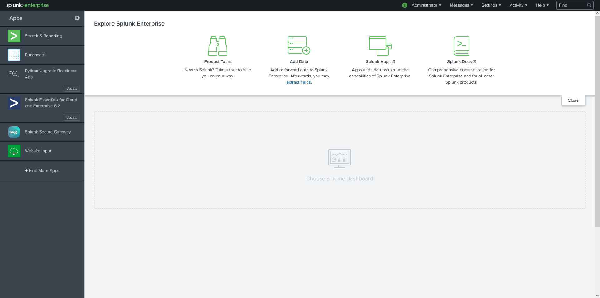
2. Click the "New Input" tab, in which you will start the process to create the web scraper. Enter the website you want to use in the URL section. Then, enter the interval that the web input will update. Click the "Next" button. 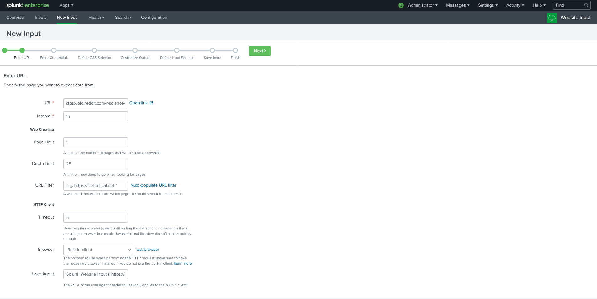
3. Skip "Enter Credentials" by clicking "Next". On the "CSS Selector" tab, a preview of your website will show up on the bottom half of the page. 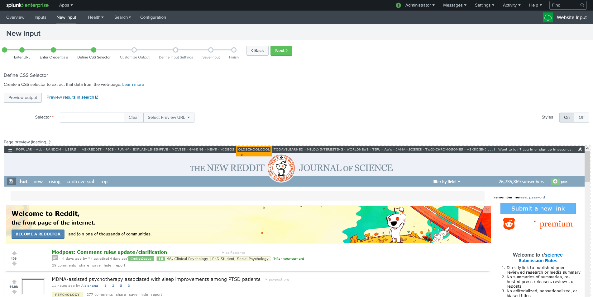
4. In the website preview, click the element that you want to record. For this example, I clicked the titles of the articles. 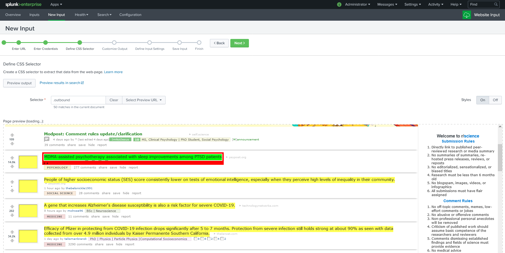
5. Skip "Customize Output" and "Define Input Settings" by clicking "Next" twice. Enter the title of your input. The bottom text box fills automatically according to the title you put in. Click "Next" to finalize your web input. 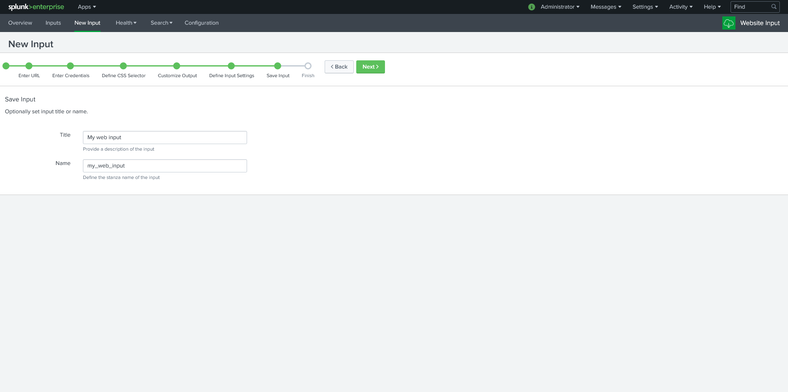
6. Click the "Overview" tab. This is where you can see all of your current and previous web inputs. 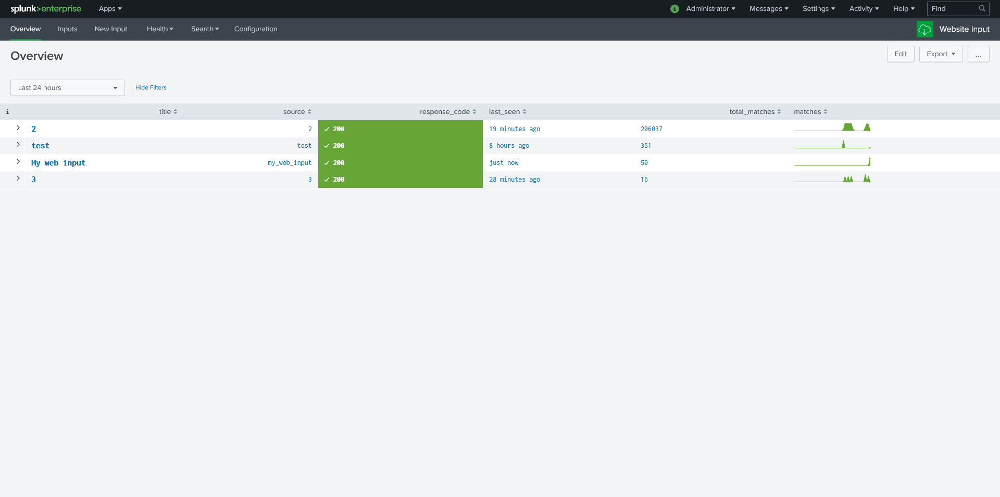
7. Click on your web input. A Search should pop up with the data that the web input gathered. 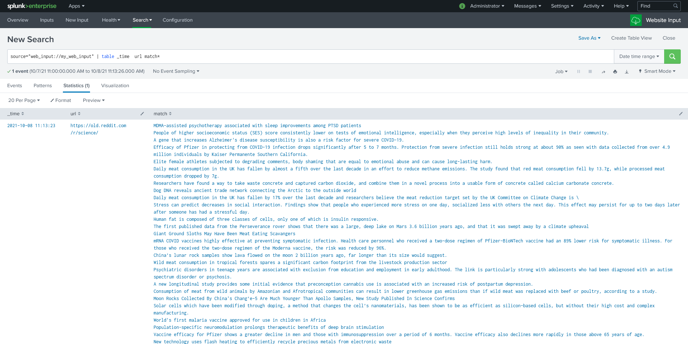

## Credits
- https://www.splunk.com/
- [File and Directory monitoring](https://docs.splunk.com/Documentation/Splunk/8.2.2/Data/MonitorfilesanddirectorieswithSplunkWeb)
- For additional training for Splunk and various tools: https://www.splunk.com/en_us/training.html?sort=Newest
- https://www.splunk.com/en_us/blog/tips-and-tricks/using-splunk-for-computer-forensics-2.html
- Plaso Log2timeline in WSL2: https://www.youtube.com/watch?v=g9V6OUCe12k&t=892s
- Looking at .cvs files in Splunk: https://www.youtube.com/watch?v=fKoAB6n_ivs&t=14s
- Splunk table: https://docs.splunk.com/Documentation/DashApp/0.9.0/DashApp/chartsTable
- Website input for Splunk: https://splunkbase.splunk.com/app/1818/
