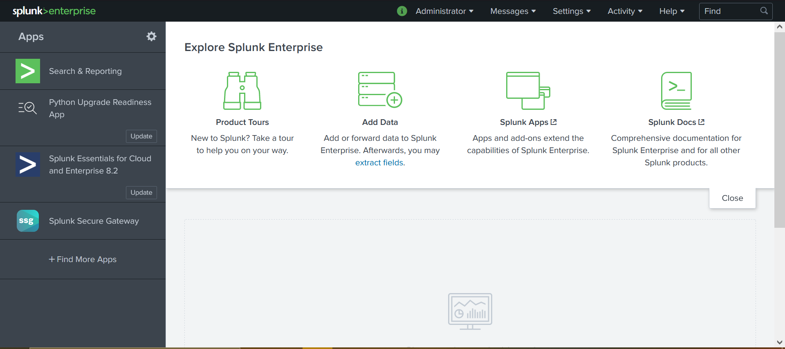

# splunk-group-workshop
##  The Team
|  |  | |  |
|------------------------------------------------------------------------------------------|-----------------------------------------------------------------------------------|-----------------------------------------------------------------------|---------------------------------------------------------------------|
| Blake Bennett | Seth Bennett | Logan Krohn | Zach Watson |

---

## Blake Bennett - Download and Installation

### How to Install
1. Head to https://www.splunk.com/ and click on the Free Splunk button in the top right hand corner  
2. Fill out information to create an account or login if you have a pre-existng account. Once logged in click the download for the application version of Splunk Enterprise.
3. Once it is downloaded run the installation file and run through the setup wizard. When it asks you to create an account remember your credentials for later. (Note: This step can take some time when installing)
4. It will lauch a server that your computer hosts and it will ask you to login using the credentials you created in the installation. 
5. Once logged in you will be directed to the homepage of the application and you have succesfully completed the installation of Splunk. 
### How to Add Apps to Splunk
1. Once at the main page click on "Find More Apps" in the side navigation bar and it will take you to a seperate page.
2. Once there you can filter through different apps and find an app that will enhance your usage of splunk.
3. When you have found an app you want to install you simply click the green install button and it will prompt you to enter your credentials.
4. Once you have entered in your credentials successfully the app will be added to Splunk Enterprise. 
## Seth Bennett - Local System Monitoring
### Setting up File Directory Monitoring
1. Starting from the Splunk Dashboard First click "Settings" in the top right then click "Add Data"
    - 
2. From this point proceed to click the "Monitor" Button in the bottom section of the page
    - 
3. From this point you must select what source of data you would like to use I will will be using File & Directories in the example.
    - From Here Enter the exact File or Directory you would  like to monitor the files in and click next
    *I would recomend Being as specific as possible, the amount of information can be quite verbose*
    - 
4.  Next, you will be have several options, one of which is index, you may use one of the default indexes but I suggest Creating a new index for the specific job as seen in the pictures below and then click next
    - 
    - 
    - 
5. From here you should be met with this page confirming the information you have given and you may click submit
    - 
6. You have now successfully linked the monitor to your specified file or directory
### Searching your index
1. Starting from the Splunk Dashboard First click "Settings" in the top right then click "Monitor"
    - 
2. Once on the Monitor page click the "Run a Search" button in the top navbar
    - 
3. Now that you are ready to search your index, you may search by source, index, or both. Below are the syntaxs for the two options
    - source="YourFullDirectoryPath\\*"
    - index="YourIndexName"
    - 
---

## Logan Krohn - Plaso and Log2Timeline for Splunk

1. Go to https://plaso.readthedocs.io/en/latest/sources/user/Ubuntu-Packaged-Release.html and use the following commands in WSL to install the repository and Plaso for Ubuntu 20.04. 
2. Find a disk image you want to use and use the command 'log2timeline.py plaso.dump name-of-disk-image'. If asked to choose a partition, select the partition with the most content. If asked to select a VSS(volume shadow snapshot), select -all.
4. After completion use the command 'psort.py -o l2tcsv -w timeline.csv plaso.dump' to sort the content and write the database into a .csv file which we will use later.
5. In Splunk, go to settings and create a new index. Once done, go back to settings/Data Inputs/File and Directories and choose your .csv file to add to your index. 
7. Explore the index with the Search tool and the bar chart showing you the activity of the Image file in chronological order. 
 
## Zach Watson - Web Input for Splunk

## Credits
- https://www.splunk.com/
